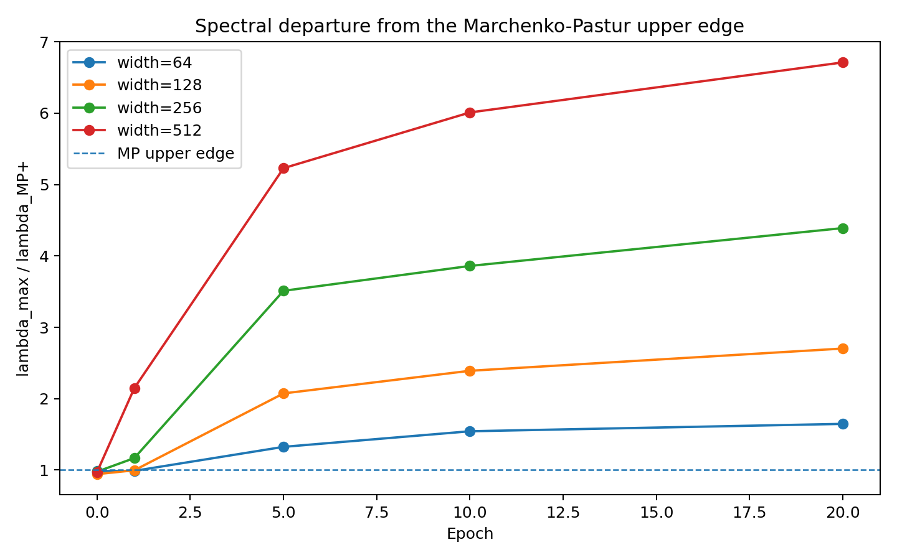
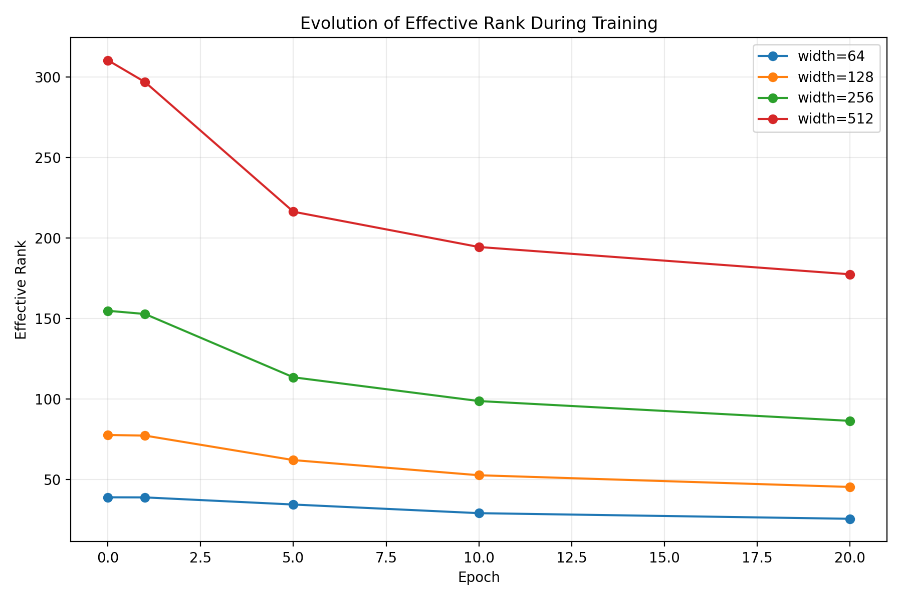
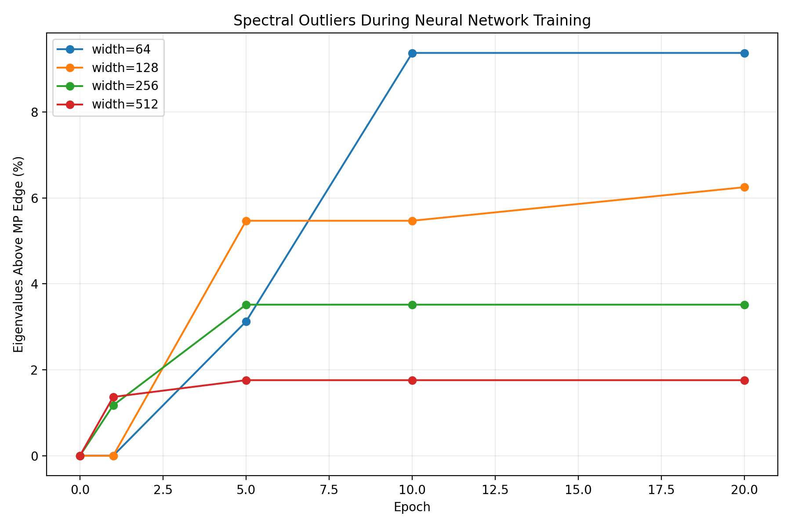
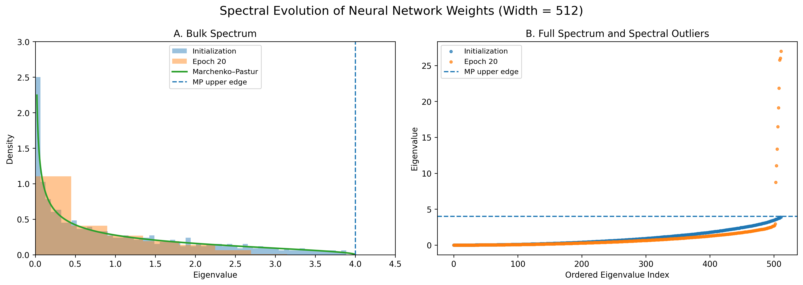

# Random Matrix Theory for Deep Learning

**Spectral Dynamics of Neural Network Weight Matrices During Training**

**Author:** Faezeh Foroughi Abari

## Overview

This project investigates how the spectral properties of neural-network weight matrices evolve during training and how these properties compare with predictions from Random Matrix Theory (RMT).

A multilayer perceptron is trained at different hidden-layer widths, and the eigenvalue spectrum of its weight Gram matrices is analyzed throughout optimization.

The central question is:

> **How do neural-network weight spectra change during training, and how does network width affect their departure from the Marchenko–Pastur random-matrix baseline?**

---

## Mathematical Background

For a random matrix with aspect ratio

\[
\gamma = \frac{\min(n,p)}{\max(n,p)},
\]

the Marchenko–Pastur distribution has support

\[
\lambda_{\pm} = (1 \pm \sqrt{\gamma})^2.
\]

For the square hidden-to-hidden weight matrices studied here,

\[
\gamma = 1,
\]

which gives

\[
\lambda_- = 0,
\qquad
\lambda_+ = 4.
\]

The Marchenko–Pastur law is used as a **random-matrix reference model**. Trained neural-network weights do not satisfy the classical i.i.d. assumptions, so deviations from the MP bulk are interpreted as empirical spectral structure rather than violations of the theorem.

---

## Experimental Setup

The experiments use:

- Python and PyTorch
- scikit-learn Digits dataset
- multilayer perceptron (MLP)
- Adam optimizer
- 20 training epochs
- random seed: `42`
- hidden widths: `64`, `128`, `256`, and `512`

Spectral statistics are recorded at:

`epoch 0`, `1`, `5`, `10`, and `20`.

For each weight matrix, the analysis computes:

- largest Gram-matrix eigenvalue
- Marchenko–Pastur upper edge
- ratio \(\lambda_{\max}/\lambda_{MP+}\)
- fraction of eigenvalues above the MP edge
- effective rank

---

## Results

### 1. Spectral Departure During Training

At initialization, the largest eigenvalues are close to the Marchenko–Pastur upper edge.

During training, the spectra progressively depart from the random-matrix baseline.

For the hidden-to-hidden layer:

| Width | Epoch 0 | Epoch 20 |
|------:|--------:|---------:|
| 64  | 0.98 | 1.65 |
| 128 | 0.94 | 2.70 |
| 256 | 0.98 | 4.39 |
| 512 | 0.97 | 6.71 |

Values represent:

\[
\frac{\lambda_{\max}}{\lambda_{MP+}}
\]

The departure becomes substantially stronger for wider networks.



---

### 2. Effective Rank

Training also changes the distribution of spectral mass.

The effective rank decreases consistently during optimization:

| Width | Epoch 0 | Epoch 20 |
|------:|--------:|---------:|
| 64  | 38.92 | 25.56 |
| 128 | 77.65 | 45.35 |
| 256 | 154.85 | 86.43 |
| 512 | 310.54 | 177.53 |

This indicates increasing concentration of spectral mass in fewer dominant directions.



---

### 3. Spectral Outliers

At initialization, no eigenvalues of the analyzed hidden layer lie above the MP upper edge.

During training, spectral outliers emerge.

Interestingly, wider networks do not necessarily produce a larger **fraction** of outliers. Instead, they can produce substantially stronger extreme eigenvalues.

At epoch 20:

| Width | Eigenvalues Above MP Edge |
|------:|--------------------------:|
| 64  | 9.38% |
| 128 | 6.25% |
| 256 | 3.52% |
| 512 | 1.76% |

Thus, the **number of outliers** and the **strength of the largest outlier** capture different aspects of spectral restructuring.



---

### 4. Spectrum Before and After Training

A separate reproducible experiment with width `512` compares the complete spectrum at initialization and after 20 epochs.

The largest eigenvalue changes from approximately

\[
3.89
\]

at initialization to

\[
26.97
\]

after training.

At initialization, the spectrum remains close to the Marchenko–Pastur bulk. After optimization, several large spectral outliers appear beyond the MP upper edge.



---

## Main Observations

The experiments show three consistent empirical patterns:

1. **Random-like initialization**

   The initial spectra are close to the Marchenko–Pastur reference, with the largest eigenvalues near the theoretical upper edge.

2. **Spectral restructuring during optimization**

   Training produces eigenvalue outliers beyond the MP bulk while reducing effective rank.

3. **Width-dependent spectral behavior**

   Wider networks exhibit substantially stronger extreme spectral outliers, although the fraction of eigenvalues outside the MP bulk can be smaller.

These observations suggest that optimization introduces structured correlations into weight matrices that are absent at random initialization.

The results should not be interpreted as proving a causal relationship between spectral outliers, feature learning, or generalization. They provide an empirical RMT-based characterization of changes in neural-network weights during training.

---

## Repository Structure

```text
rmt-deep-learning/
│
├── README.md
├── LICENSE
├── requirements.txt
├── run_width_study.py
│
├── src/
│   ├── __init__.py
│   ├── model.py
│   ├── experiment.py
│   ├── rmt_utils.py
│   ├── plot_results.py
│   └── plot_spectrum_comparison.py
│
└── results/
    ├── spectral_width_64.json
    ├── spectral_width_128.json
    ├── spectral_width_256.json
    ├── spectral_width_512.json
    │
    └── figures/
        ├── spectral_dynamics.png
        ├── effective_rank.png
        ├── mp_outliers.png
        └── spectrum_before_after_training.png
```

---

## Installation

```bash
git clone <YOUR-REPOSITORY-URL>
cd rmt-deep-learning

pip install -r requirements.txt
```

---

## Reproducing the Width Experiment

Run:

```bash
python run_width_study.py
```

This trains networks with widths:

```text
64
128
256
512
```

and stores the spectral statistics in the `results/` directory.

---

## Generate the Spectral-Dynamics Figure

```bash
python src/plot_results.py \
results/spectral_width_64.json \
results/spectral_width_128.json \
results/spectral_width_256.json \
results/spectral_width_512.json
```

---

## Reproduce the Spectrum Comparison

Run:

```bash
python -m src.plot_spectrum_comparison
```

This reproduces the width-512 experiment and generates the before/after spectral comparison.

---

## Limitations

This project is a compact computational investigation rather than a theoretical proof.

The main limitations are:

- experiments use a relatively small benchmark dataset;
- the architecture is limited to multilayer perceptrons;
- only selected network widths are examined;
- the MP distribution is used as a reference baseline;
- trained weights no longer satisfy the independence assumptions of classical random-matrix models.

Possible future work includes deeper architectures, alternative initialization schemes, different optimizers, regularization, larger datasets, and more detailed empirical spectral-density analysis.

---

## Technologies

- Python
- PyTorch
- NumPy
- scikit-learn
- Matplotlib
- Random Matrix Theory
- Spectral Analysis

---

## Author

**Faezeh Foroughi Abari**

M.Sc. Data Science  
M.Sc. Mathematics and Applications (Algebra)
